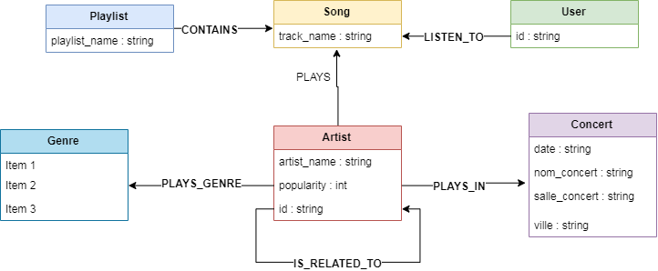
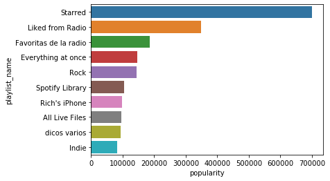
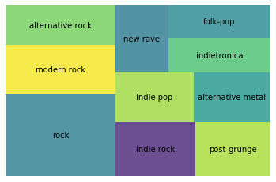
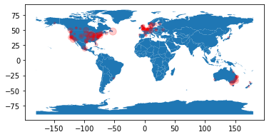
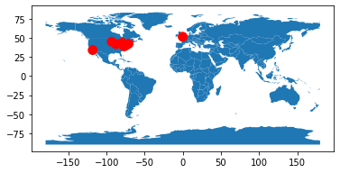

# Rendu projet Neo4J - Neo4Spotify


<p align="center">
  
</p>

## Introduction
Ce travail a été réalisé par Baptiste Chezaubernard, Alix Ouedraogo et Alexis Aubrée.

Nous avons choisi de rendre un notebook, car ce format nous permet de mélanger la documentation du travail réalisé avec du code et de la visualisation.
Les requêtes sont présentes dans ce rapport et peuvent être utilisées indépendamment de ce support.


Le format notebook nous a également permis d'apprendre à utiliser le wrapper Neo4j de python, qui est assez agréable à utiliser.

Ci dessous, nous importons l'ensemble des librairies et fonctions nécessaires au bon fonctionnement de ce notebook.

Avant de lancer ce notebook, il faut executer la commande ```pip install -r requirements.txt```


```python
%run python/utils.py
```

    Imports réalisés
    

### Contexte
Ce projet a pour but d'utiliser Neo4j pour étudier des graphes.
Nous avons choisi d'utiliser les données de [spotify](https://zenodo.org/record/2594557#.XeYt25NKhqO).

Ces données représentent les interractions entre les utilisateurs, les chansons, les playlists et les artistes. Les chansons et artistes sont majoritairement du genre rock.

Une partie des données est présentées ci-dessous.


```python
readHead("data/base.csv")
```


<div>
<style scoped>
    .dataframe tbody tr th:only-of-type {
        vertical-align: middle;
    }

    .dataframe tbody tr th {
        vertical-align: top;
    }

    .dataframe thead th {
        text-align: right;
    }
</style>
<table border="1" class="dataframe">
  <thead>
    <tr style="text-align: right;">
      <th></th>
      <th>user_id</th>
      <th>artist_name</th>
      <th>track_name</th>
      <th>playlist_name</th>
    </tr>
  </thead>
  <tbody>
    <tr>
      <th>0</th>
      <td>9cc0cfd4d7d7885102480dd99e7a90d6</td>
      <td>Elvis Costello</td>
      <td>(The Angels Wanna Wear My) Red Shoes</td>
      <td>HARD ROCK 2010</td>
    </tr>
    <tr>
      <th>1</th>
      <td>9cc0cfd4d7d7885102480dd99e7a90d6</td>
      <td>Elvis Costello &amp; The Attractions</td>
      <td>(What's So Funny 'Bout) Peace, Love And Unders...</td>
      <td>HARD ROCK 2010</td>
    </tr>
    <tr>
      <th>2</th>
      <td>9cc0cfd4d7d7885102480dd99e7a90d6</td>
      <td>Tiffany Page</td>
      <td>7 Years Too Late</td>
      <td>HARD ROCK 2010</td>
    </tr>
  </tbody>
</table>
</div>


Nous avons enrichi ces données à l'aide de l'API de spotify. Nous avons rajouté pour chaque artiste les artistes liés, la popularité, leurs genres musicaux.

Un extrait du fichier obtenu est présenté ci-dessous.


```python
readHead("data/artists.csv")
```


<div>
<style scoped>
    .dataframe tbody tr th:only-of-type {
        vertical-align: middle;
    }

    .dataframe tbody tr th {
        vertical-align: top;
    }

    .dataframe thead th {
        text-align: right;
    }
</style>
<table border="1" class="dataframe">
  <thead>
    <tr style="text-align: right;">
      <th></th>
      <th>artist_name</th>
      <th>artist_id</th>
      <th>genres</th>
      <th>popularity</th>
      <th>related</th>
    </tr>
  </thead>
  <tbody>
    <tr>
      <th>0</th>
      <td>Elvis Costello</td>
      <td>2BGRfQgtzikz1pzAD0kaEn</td>
      <td>['art rock', 'dance rock', 'folk', 'folk rock'...</td>
      <td>60.0</td>
      <td>['Elvis Costello &amp; The Attractions', 'Squeeze'...</td>
    </tr>
    <tr>
      <th>1</th>
      <td>Elvis Costello &amp; The Attractions</td>
      <td>4qmHkMxr6pTWh5Zo74odpH</td>
      <td>['art rock', 'comic', 'dance rock', 'folk rock...</td>
      <td>59.0</td>
      <td>['Elvis Costello', 'Squeeze', 'Joe Jackson', '...</td>
    </tr>
    <tr>
      <th>2</th>
      <td>Tiffany Page</td>
      <td>1Q6EgKHZ8mt7Hm5bKa6DbG</td>
      <td>[]</td>
      <td>4.0</td>
      <td>['Heidi Range', 'Alex Roots', 'Hepburn', 'Heav...</td>
    </tr>
  </tbody>
</table>
</div>


Enfin, nous avons complété nos données à l'aide des données des concerts pour les artistes. Ces données ont été obtenue à l'aide du site [concertarchive](https://www.concertarchives.org/).

Une partie de ces données est présentée ci-dessous


```python
readHead("data/concerts.csv", delimiter="|")
```


<div>
<style scoped>
    .dataframe tbody tr th:only-of-type {
        vertical-align: middle;
    }

    .dataframe tbody tr th {
        vertical-align: top;
    }

    .dataframe thead th {
        text-align: right;
    }
</style>
<table border="1" class="dataframe">
  <thead>
    <tr style="text-align: right;">
      <th></th>
      <th>id</th>
      <th>artist</th>
      <th>date</th>
      <th>nom_concert</th>
      <th>endroit</th>
      <th>ville</th>
    </tr>
  </thead>
  <tbody>
    <tr>
      <th>0</th>
      <td>0</td>
      <td>Elvis Costello</td>
      <td>Mar 08, 2014</td>
      <td>Elvis Costello / Elvis Costello &amp; The Imposters</td>
      <td>Caesar's Atlantic City</td>
      <td>Atlantic City, NJ</td>
    </tr>
    <tr>
      <th>1</th>
      <td>1</td>
      <td>Elvis Costello</td>
      <td>Jul 06, 2003</td>
      <td>Elvis Costello &amp; The Imposters / Imposters / E...</td>
      <td>Taste of Chicago</td>
      <td>Chicago, IL</td>
    </tr>
    <tr>
      <th>2</th>
      <td>2</td>
      <td>Elvis Costello</td>
      <td>Nov 10, 2019</td>
      <td>Elvis Costello &amp; The Imposters / Elvis Costell...</td>
      <td>The Mahaffey Theater</td>
      <td>St Petersburg, FL</td>
    </tr>
  </tbody>
</table>
</div>


Au final, nous obtenons le schéma ci-dessous



## 1. Imports des données

### Connexion à la base de données

Les informations de connexion à la base de données peuvent être changées au besoin.


```python
DB_URI = "bolt://localhost:7687"
DB_USER = "neo4j"
DB_PASSWORD = "password"
driver = GraphDatabase.driver(DB_URI, auth=(DB_USER, DB_PASSWORD))
```

### Définition de la structure de la base

Nous créons des contraintes sur tous les objets, sauf sur concert, tous les attributs sont importants pour les concerts


```python
CONSTRAINTS=[
    # On vérifie que l'ID utilisateur est unique
    "CREATE CONSTRAINT ON (u:User) ASSERT u.id IS UNIQUE;",
    # On vérifie que le nom du son est unique
    "CREATE CONSTRAINT ON (s:Song) ASSERT s.track_name IS UNIQUE;",
    # On vérifie que le nom de l'artiste est unique
    "CREATE CONSTRAINT ON (a:Artist) ASSERT a.artist_name IS UNIQUE;", 
    # On vérifie que le nom de la playlist est unique
    "CREATE CONSTRAINT ON (p:Playlist) ASSERT p.playlist_name IS UNIQUE; ",
    # On vérifie que le nom du genre est unique
    "CREATE CONSTRAINT ON (g:Genre) ASSERT g.genre_name IS UNIQUE;",
    # On vérifie qu'il n'y a pas 2 concerts qui portent le même nom le même jour
    "CREATE CONSTRAINT ON (c:Concert) ASSERT (c.date, c.nom_concert) IS NODE KEY",
    # On vérifie que le nom de la ville est unique
    "CREATE CONSTRAINT ON (v:Ville) ASSERT v.ville_name IS UNIQUE;"
]
with driver.session() as session:
    for constraint in CONSTRAINTS:
        session.run(constraint)
```

### Import des données

⚠️⚠️⚠️ 

Les 4 fichiers CSV base, artists, concerts et villes doivent être copiées dans le répértoire 'import' de la base de données Neo4j 

⚠️⚠️⚠️

Import de la base (Temps de traitement long ~8 minutes)


```python
REQUETE = """
// Import file base.csv
USING PERIODIC COMMIT 1000
LOAD CSV WITH HEADERS FROM 'file:///base.csv'
 	AS ligne FIELDTERMINATOR ';'

    // If there is a track name
    FOREACH(ignoreMe IN CASE WHEN ligne.track_name <> '' THEN [1] ELSE [] END |
        MERGE (u:User {id: ligne.user_id})
        MERGE (s:Song {track_name: ligne.track_name})
        MERGE (a:Artist {artist_name: ligne.artist_name})
        // If there is a playlist name
        FOREACH(ignoreMe IN CASE WHEN ligne.playlist_name <> '' THEN [1] ELSE [] END |
            MERGE (p:Playlist {playlist_name: ligne.playlist_name})
            MERGE (p)-[:CONTAINS]->(s)
        )
        MERGE (u)-[:LISTEN_TO]->(s)
        MERGE (a)-[:PLAYS]->(s)
    )

"""
with driver.session() as session:
    session.run(REQUETE)
```

a la suite de la commande, nous avons 198301 sons, 32183 playlist et 5224 utilisateurs. Ces informations ont été récupérées à l'aide de commandes 
* ```MATCH (s:Song) RETURN COUNT(s)```
* ```MATCH (c:User) RETURN COUNT(c)```
* ```MATCH (p:Playlist) RETURN COUNT(p)```

Import des artistes ~1 minutes


```python
REQUETE = """
// Import file artists.csv
USING PERIODIC COMMIT 1000
LOAD CSV WITH HEADERS FROM 'file:///artists.csv'
 	AS ligne FIELDTERMINATOR ';'
    
    MERGE (a:Artist {artist_name: ligne.artist_name})
    SET a.id = ligne.artist_id
    SET a.popularity = ligne.popularity
    FOREACH(genre IN split(ligne.genres, "', '") |
        // In order to remove the [' & '] before the lines
        MERGE(g:Genre {
            genre_name: replace(
                replace(genre, "['", "")
            , "']", "")
            })
        MERGE (a)-[:PLAYS_GENRE]->(g)
    )
    FOREACH(relatedArtist IN split(ligne.related, "', '") |
        // In order to remove the [' & '] before the lines
        MERGE(rA:Artist {
            artist_name: replace(
                replace(relatedArtist, "['", "")
            , "']", "")
            })
        MERGE (a)-[:IS_RELATED_TO]->(rA)
    )

"""
with driver.session() as session:
    session.run(REQUETE)
```

Après l'import, nous avons des liens entre 13715 artistes. Cette information a été récupérée à l'aide de la commande ```MATCH (a:Artist) RETURN COUNT(a)```

Import des concerts ~2 minutes


```python
REQUETE = """
// Import file concerts.csv
USING PERIODIC COMMIT 500
LOAD CSV WITH HEADERS FROM 'file:///concerts.csv'
 	AS ligne FIELDTERMINATOR '|'
    
    MERGE (a:Artist {artist_name: ligne.artist})

    MERGE (c:Concert {
        date: ligne.date,
        nom_concert: ligne.nom_concert
        })
    SET c.salle_concert= ligne.endroit
    MERGE(v:Ville {ville_name: ligne.ville})
    MERGE (a)-[:PLAYS_IN]->(c)
    MERGE (c)-[:IS_IN]->(v)
"""
with driver.session() as session:
    session.run(REQUETE)
```

Après import, nous avons les informations sur 49240 concerts (```MATCH (c:Concert) RETURN COUNT(c)```

On importe ensuite les informations des villes. Ces informations ont été récupérées à l'aide de l'API google maps


```python
REQUETE = """
// Import file villes.csv
USING PERIODIC COMMIT 500
LOAD CSV WITH HEADERS FROM 'file:///villes.csv'
 	AS ligne FIELDTERMINATOR '|'
    FOREACH(ignoreMe IN CASE WHEN ligne.ville <> '' THEN [1] ELSE [] END |

        MERGE (v:Ville {ville_name: ligne.ville})
        SET v.lat = ligne.lat
        SET v.lng = ligne.lng
    )
"""
with driver.session() as session:
    session.run(REQUETE)
```

## 2. Requetes
### 2.1 - PageRank

⚠️⚠️⚠️ Nécessite d'avoir installé le plugin [GRAPH ALGORITHMS](https://neo4j.com/developer/graph-algorithms/) ⚠️⚠️⚠️
Ce plugin peut être installé depuis neo4jDesktop

La requête ci-dessous calcule le page rang pour chaque artiste


```python
REQUETE = """
CALL algo.pageRank.stream('Artist', 'IS_RELATED_TO', {iterations:40, dampingFactor:0.85})
YIELD nodeId, score

RETURN algo.asNode(nodeId).artist_name AS Artist,score
ORDER BY score DESC
LIMIT 10
"""
print("{0:40} {1:30}".format("Artiste","Score"))
with driver.session() as session:
    for record in session.run(REQUETE):
        print("{0:30} {1:30}".format(record['Artist'],record['score']))
```

    Artiste                                  Score                         
    Michael Kamen                                 5.0137957130617
    John Ottman                                 4.996194732544247
    []                                          4.690464502439641
    Harald Kloser                               4.497847340675072
    The Pigeon Detectives                       4.408093413661119
    Marco Beltrami                              4.282494705199496
    The Rifles                                 3.9911143187149714
    Randy Edelman                              3.7172480927256415
    Submersed                                  3.6457828473794502
    Ilan Eshkeri                                3.577738009375752
    

On remarque que les artistes les plus liés aux autres artistes sont Michael Kamen et John Ottman.
L'artiste "\[\]" indique les artistes qui ne pointent sur aucun autre artiste.

On remarque également que le pageRank n'est pas une mesure efficace de la popularité d'un artiste. Après étude, nous avons remarqué que les graphes représentants les artistes liés sont cycliques, avec un nombre faibles de noeuds (~30). Seule la taille du cycle compte pour le pageRank.

Le pageRank étant une information importante, on décide de la sauvegarder dans le champ artiste. Pour ce faire, on execute la requete ci-dessous.


```python
REQUETE = """
CALL algo.pageRank('Artist', 'IS_RELATED_TO',
  {iterations:40, dampingFactor:0.85, write: true,writeProperty:"pagerank"})
YIELD nodes, iterations, loadMillis, computeMillis, writeMillis, dampingFactor, write, writeProperty
"""
with driver.session() as session:
    for record in session.run(REQUETE):
         print(record)
```

    <Record nodes=13715 iterations=40 loadMillis=57 computeMillis=72 writeMillis=300 dampingFactor=0.85 write=True writeProperty='pagerank'>
    

### 2.2 Les playlists les plus écoutées
On récupère les 10 playlist les plus écoutées.
Le traitement un peu long (~30 secondes)


```python
REQUETE = """
// The 30 most listened playlist with the number of plays
MATCH(u:User)-[:LISTEN_TO]->(s:Song)<-[:CONTAINS]-(p:Playlist)
WITH p, count(u) AS popularity
RETURN p.playlist_name AS playlist_name, popularity
ORDER BY popularity DESC
LIMIT 10
"""
data=[]
with driver.session() as session:
    for record in session.run(REQUETE):
        print("{0:30} {1:30}".format(record['playlist_name'],record['popularity']))
        data.append([record['playlist_name'], record['popularity']])
# Un peu de visualisation
df = pd.DataFrame.from_records(data, columns=["playlist_name", "popularity"])
fig = sns.barplot(x = 'popularity', y = 'playlist_name', 
                  data = df,)
```

    Starred                                                700911
    Liked from Radio                                       348844
    Favoritas de la radio                                  186597
    Everything at once                                     145865
    Rock                                                   142998
    Spotify Library                                        105257
    Rich's iPhone                                           97709
    All Live Files                                          95662
    dicos varios                                            94305
    Indie                                                   83164
    





### 2.3 Les genres les plus écoutés
On récupère le nombre d'écoute de chaque genre et on l'enregistre au sein du noeud.


```python
REQUETE = """
// The 10 most listened playlist with the number of plays
MATCH(u:User)-[:LISTEN_TO]->(s:Song)<-[:PLAYS]-(a:Artist)-[:PLAYS_GENRE]->(g:Genre)
WITH g, count(u) AS popularity
SET g.popularity=popularity
RETURN g.genre_name as genre_name, popularity
ORDER BY popularity DESC
LIMIT 10
"""
data=[]
with driver.session() as session:
    for record in session.run(REQUETE):
        data.append([record['genre_name'], record['popularity']])
# Un peu de visualisation
df = pd.DataFrame.from_records(data, columns=["genre_name", "popularity"])
squarify.plot(sizes=df['popularity'], label=df['genre_name'], alpha=.8 )
plt.axis('off')
plt.show()
```





### La localisation géographique des concerts d'un utilisateur
Cette requête retourne la localisation des concerts réalisés en 2012 par les artistes écoutés par un utilisateur. Les données sont agrégées par le nombre de concert.


```python
REQUETE = """
// La localisation des concerts des artistes écoutés par un utilisateur sur l'année 2012
MATCH (u:User)-[:LISTEN_TO]->(s:Song)<-[:PLAYS]-(a:Artist)-[:PLAYS_IN]->(c:Concert)-[:IS_IN]->(v:Ville)
WHERE u.id="9cc0cfd4d7d7885102480dd99e7a90d6"
AND c.date CONTAINS "2012"
return v.ville_name AS ville,
	v.lat AS lat,
    v.lng AS lng,
    count(c) AS compte
"""

data=[]
with driver.session() as session:
    for record in session.run(REQUETE):
        data.append([record['ville'], record['lat'], record['lng'], record['compte']])
df = pd.DataFrame.from_records(data, columns=["ville", "lat", "lng", "compte"])
df.head()

```


<div>
<style scoped>
    .dataframe tbody tr th:only-of-type {
        vertical-align: middle;
    }

    .dataframe tbody tr th {
        vertical-align: top;
    }

    .dataframe thead th {
        text-align: right;
    }
</style>
<table border="1" class="dataframe">
  <thead>
    <tr style="text-align: right;">
      <th></th>
      <th>ville</th>
      <th>lat</th>
      <th>lng</th>
      <th>compte</th>
    </tr>
  </thead>
  <tbody>
    <tr>
      <th>0</th>
      <td>Hamburg, DE</td>
      <td>53.5510846</td>
      <td>9.9936819</td>
      <td>1</td>
    </tr>
    <tr>
      <th>1</th>
      <td>New York, NY</td>
      <td>40.7127753</td>
      <td>-74.0059728</td>
      <td>9</td>
    </tr>
    <tr>
      <th>2</th>
      <td>Gent, BE</td>
      <td>51.0543422</td>
      <td>3.7174243</td>
      <td>1</td>
    </tr>
    <tr>
      <th>3</th>
      <td>Brisbane Australia</td>
      <td>-27.4697707</td>
      <td>153.0251235</td>
      <td>3</td>
    </tr>
    <tr>
      <th>4</th>
      <td>Melbourne, VIC</td>
      <td>-37.8136276</td>
      <td>144.9630576</td>
      <td>7</td>
    </tr>
  </tbody>
</table>
</div>


Afin de mieux visualiser les concerts, nous avons intégré une visualisation sur une carte du monde.
On se rend compte que cet utilisateur écoute des artistes qui se produisent principalement aux Etats Unis, en Europe et en Australie sur l'année 2012


```python
visualiserVilles(df)
```





### Les 10 villes les plus influentes par rapport au nombre d'écoute
.
Le temps de traitement est un peu long. En effet, on parcours tout le schéma et on utilise tous les (nombreux) utilisateurs


```python
REQUETE = """
// Les villes les plus influente proportionnellement au nombre d'écoute
MATCH (v:Ville)<-[:IS_IN]-(c:Concert)<-[:PLAYS_IN]-(a:Artist)-[:PLAYS]->(s:Song)<-[:LISTEN_TO]-(u:User)
RETURN v.ville_name AS ville,
    v.lat AS lat,
    v.lng AS lng,
    COUNT(DISTINCT u) AS compte
ORDER BY compte DESC
LIMIT 10
"""

data=[]
with driver.session() as session:
    for record in session.run(REQUETE):
        data.append([record['ville'], record['lat'], record['lng'], record['compte']])
df = pd.DataFrame.from_records(data, columns=["ville", "lat", "lng", "compte"])
df.head()
```


<div>
<style scoped>
    .dataframe tbody tr th:only-of-type {
        vertical-align: middle;
    }

    .dataframe tbody tr th {
        vertical-align: top;
    }

    .dataframe thead th {
        text-align: right;
    }
</style>
<table border="1" class="dataframe">
  <thead>
    <tr style="text-align: right;">
      <th></th>
      <th>ville</th>
      <th>lat</th>
      <th>lng</th>
      <th>compte</th>
    </tr>
  </thead>
  <tbody>
    <tr>
      <th>0</th>
      <td>Chicago, IL</td>
      <td>41.8781136</td>
      <td>-87.6297982</td>
      <td>5019</td>
    </tr>
    <tr>
      <th>1</th>
      <td>NA</td>
      <td>None</td>
      <td>None</td>
      <td>4979</td>
    </tr>
    <tr>
      <th>2</th>
      <td>New York, NY</td>
      <td>40.7127753</td>
      <td>-74.0059728</td>
      <td>4967</td>
    </tr>
    <tr>
      <th>3</th>
      <td>London, UK</td>
      <td>51.5073509</td>
      <td>-0.1277583</td>
      <td>4952</td>
    </tr>
    <tr>
      <th>4</th>
      <td>Philadelphia, PA</td>
      <td>39.9525839</td>
      <td>-75.1652215</td>
      <td>4888</td>
    </tr>
  </tbody>
</table>
</div>


```python
visualiserVilles(df, alpha=1)
```





Les villes dans le Top 10 sont Londres, Chicago, New York et Philadelphie

### Les artistes qui jouent plusieurs genres
Nous avons décidé de regarder les artistes qui jouent à la fois de l'indietronica, de la folk-pop et de l'escape room, pour pouvoir recommander des artistes à un ami.

Voici nos résultats :


```python

REQUETE = """
// Les artistes qui jouent à la fois de l'indietronica, de la folk-pop et de l'escape room (?).
MATCH (g:Genre)<-[:PLAYS_GENRE]-(a:Artist)
WHERE g.genre_name="folk-pop"
    WITH a
    MATCH (g:Genre)<-[:PLAYS_GENRE]-(a:Artist)
    WHERE g.genre_name="indietronica"
        WITH a
        MATCH (g:Genre)<-[:PLAYS_GENRE]-(a:Artist)
        WHERE g.genre_name="escape room"
        RETURN DISTINCT a.artist_name AS name, a.popularity AS popularity
"""

data=[]
with driver.session() as session:
    for record in session.run(REQUETE):
        data.append([record['name'], record['popularity']])
df = pd.DataFrame.from_records(data, columns=["name", "popularity"])
df.head()
```


<div>
<style scoped>
    .dataframe tbody tr th:only-of-type {
        vertical-align: middle;
    }

    .dataframe tbody tr th {
        vertical-align: top;
    }

    .dataframe thead th {
        text-align: right;
    }
</style>
<table border="1" class="dataframe">
  <thead>
    <tr style="text-align: right;">
      <th></th>
      <th>name</th>
      <th>popularity</th>
    </tr>
  </thead>
  <tbody>
    <tr>
      <th>0</th>
      <td>Sleigh Bells</td>
      <td>52.0</td>
    </tr>
    <tr>
      <th>1</th>
      <td>Sky Ferreira</td>
      <td>58.0</td>
    </tr>
    <tr>
      <th>2</th>
      <td>St. Vincent</td>
      <td>64.0</td>
    </tr>
    <tr>
      <th>3</th>
      <td>Chairlift</td>
      <td>50.0</td>
    </tr>
  </tbody>
</table>
</div>


Une rapide visualisation à l'aide de la requête suivante permet de confirmer nos résultats. 

```
// Les artistes qui jouent à la fois de l'indietronica, de la folk-pop et de l'escape room (?).
MATCH (g:Genre)<-[:PLAYS_GENRE]-(a:Artist)
WHERE g.genre_name="folk-pop"
    WITH a
    MATCH (g:Genre)<-[:PLAYS_GENRE]-(a:Artist)
    WHERE g.genre_name="indietronica"
        WITH a
        MATCH (g:Genre)<-[:PLAYS_GENRE]-(a:Artist)
        WHERE g.genre_name="escape room"

            WITH a
            MATCH (g:Genre) WHERE g.genre_name IN ["folk-pop", "indietronica","escape room"]
            RETURN DISTINCT a, g
```


## Conclusion

Ce travail aura été très interessant sur plusieurs aspects.
* Il nous aura permis d'apprendre à rechercher des données et à les scrapper si nécessaire
* Il nous aura permis de jouer avec Neo4J, de mieux en comprendre le fonctionnement et de pratiquer le langage CQL (Cypher Query Language)
* Nous avons utilisé Neo4J tel qu'il pourrait être utilisé dans le cadre de notre métier et nous sommes familiarisé avec le wrapper python
* Nous avons réalisé des visualisations interessantes et appris à utiliser la librairie GeoPandas pour visualiser des données géographiques.

