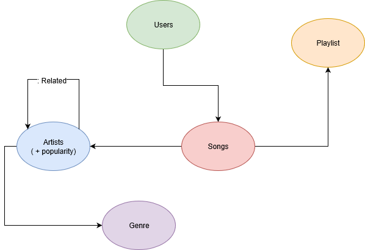

# project
Neo4J database to modelize songs relations

Parmi les requêtes à réaliser, nous avons pensé à :
Un pageRank sur les artistes afin de trouver les plus importants
Une comparaison entre ce pageRank et la popularité des artistes récupérée sur l’API, afin de savoir si le pageRank est une mesure efficace de la popularité d’un artiste
Le nombre de sons différents moyen écoutés par les utilisateurs sur les playlists
La proportion des genres de sons joués par chaque artiste
L’importance des liaisons entre les différents genres entre eux, par l’intermédiaire des artistes
Si les besoins se présentent et que le temps nous le permet, nous avons également identifié un grand nombre de dataset différents, qui pourraient se coupler avec notre modèle. Par exemple :
Une liste de genres pour chaque son, disponible sur Kaggle
Des données sur les différents festivals de musiques, mises à disposition par la BBC sur GitHub
